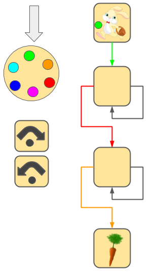

# Turing Bunny
The game that help you learn the basic of programing without a computer

You can download the game and print for yourself for free [here](#get-the-game)

## Table Of Content
<!--ts-->
   * [The Rules](#the-rules)
   * [Get the game](#get-the-game)
   * [Project Status And Roadmap](#project-status-and-roadmap)
   * [About The Game](#about-the-game)
<!--te-->

## The rules

You goal is to help the bunny get the carrot. The bunny has a changing color magic ball. There is a wheel with colors on it to visualize the colors of the ball. At the beginning of the game the color of the ball is green.

The board contains tiles and colorful arrows between them. At the beginning of the game the tiles are empty. You need to place "action cards" on them. There are two types action cards:

Change color to left

Change color to right
After you placed action cards on all the tiles you start to move the bunny
When you get to a tile, you need to perform the action
Then you need to move the bunny according to the arrows:
1. If the color of the ball match to the color of one of the arrows you need to follow this arrow
1. If it doesn't match, and there is a black arrow you need to follow it
1. If there is no arrow you can follow, you are stuck and need to re-try

When you get to the carrot - *YOU WIN*!

## Get the game
 You can download and print your own version of the game at home for free. There are two version - `Colorful` and `Black and White`. Both versions contains the same levels, the different is just in the colors. After you print, you need to follow these instructions:
 1. Cut all the pieces of the game - the Bunny, the "action cards" and the wheel
 1. Pin the wheel the dot under the arrow
 1. If you are using the Black and White version, you can color it yourself.

### Links
* Download Black and White version [here](./turing-bunny-black-and-white.pdf). 
* Download Colorful version [here]. - Coming soon
* Download the solutions [here](./turing-bunny-black-and-white-sol.pdf)

## About The Game
The game is designed to enable the player to write "code" and then mimic the behavior of a computer without touching the computer. 
The analogies are:
* The entire board represntes a [computer program](https://en.wikipedia.org/wiki/Computer_program).
* The bunny is the [instruction pointer](https://en.wikipedia.org/wiki/instruction_pointer).
* The magic ball represnts one [variable](https://en.wikipedia.org/wiki/Variable_(computer_science)) in the [memory](https://en.wikipedia.org/wiki/Computer_memory), that can contain a number between 0 to 5, one for each color.
* The "action card" represnts one [opcode](https://en.wikipedia.org/wiki/Opcode).
   * Change color to left is increment by 1.
   * Change color to right is decrement by 1.
* The arrows are [conditions](https://en.wikipedia.org/wiki/Conditional_(computer_programming))
   * colored arrow is an `if` statement.
   * black arrow is an `else` statement.

This game is "almost" [Turing complete](https://en.wikipedia.org/wiki/Turing_completeness).

## Project Status and Roadmap
The nexts steps for the game (not necessearily in this order):
### Content
- [x] 10 Levels 
- [ ] Colorful version
- [ ] 40 Levels 
- [ ] Version with two Magic Balls
### Tools
- [ ] A web app of the game 
- [ ] A web app levels editor
 
## License
### License of the game
TBD

### License of the assets
* The Bunny is under [pngwave license](https://www.pngwave.com/)
* The Carrot is under [pngguru license](https://www.pngguru.com//)